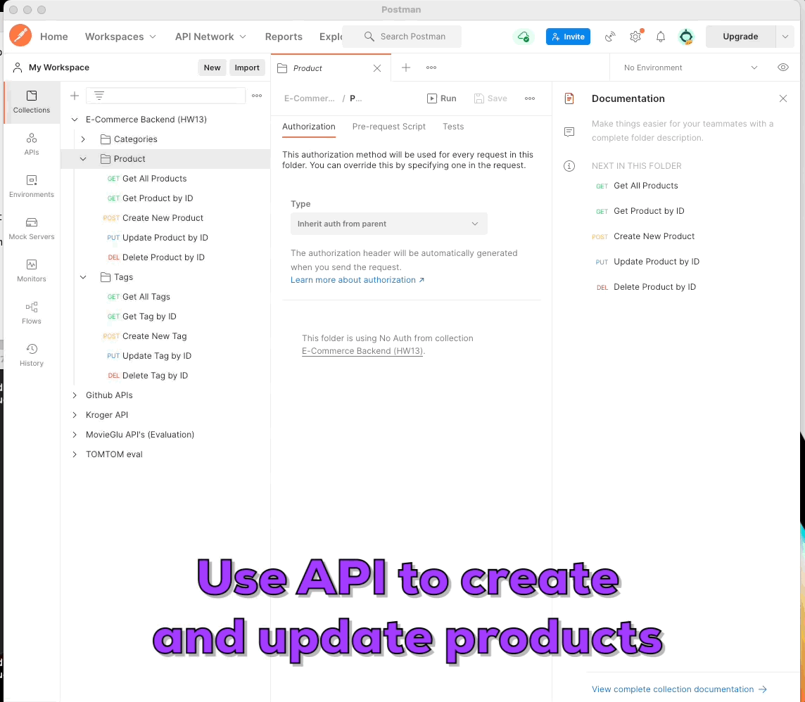

  # E-commerce Backend

  [](http://opensource.org/licenses/ISC)

  ## Description
  Here I have built the back end for an e-commerce site. You’ll configure a working Express.js API to use Sequelize to interact with a MySQL database. This is the user story:

  ```md
    AS A manager at an internet retail company
    I WANT a back end for my e-commerce website that uses the latest technologies
    SO THAT my company can compete with other e-commerce companies
  ```

  Technologies Utilized:
  Express.js, Javascript, MySQL, Sequelize and dotenv npm packages, Postman

  ## Contents

  1. [Installation](#installation)
  2. [Project Usage](#usage)
      1. [Visuals](#visuals)
  3. [Licenses](#licenses)
  4. [Testing](#testing)
  5. [How to contribute](#contributing)
  6. [Project Credits](#credits)
      1. Authors
      2. Additional Acknowledgements
  7. [Have Questions?](#questions)

  ## [Installation](#installation)
  If you plan to run the application on your local machine follow the steps below. 

  To clone repo: 
  ```md
  git clone git@github.com:jcwashington/E-Commerce-backend.git
  ```

  From within MySQL, execute the SQL script file:
  ```md
  source ~/db/schema.sql
  ```
  Run 'npm install' to install necessary dependencies. 
  Run 'npm run seed' to seed the data.
  Run 'npm start' to start the application.
  Using the tool of your choice to interact with the routes.


  ## [Project Usage](#usage)

  Below you can find some high-level API route documentation:

  Category:
  - GET `/api/categories/` will return all of the available categories. Included will also be the associated Products.
  ``` code
  Example:

  [
    {
        "id": 1,
        "category_name": "Shirts",
        "products": [
            {
                "id": 1,
                "product_name": "Plain T-Shirt",
                "price": 15,
                "stock": 14,
                "category_id": 1
            }
        ]
    }
  ]
  ```
  - GET `/api/categories/:id` will similarly return the category associated with the specified id. Included will also be the associated Products.
  - POST `/api/categories/` will allow you to create a new category. Provide a JSON request including the category_name similar to the one below:
  ``` code
  Example:

    {"category_name" : "Food"}
  ```
  - PUT `/api/categories/:id` will allow you to update a specific category. For instance, to update the category name, simply provide a JSON request, as below:
  ``` code
  Example:

    {"category_name" : "Seafood"}
  ```
  - DELETE `/api/categories/:id` will delete the category associated with the specified id.
  ---

  Products:
  - GET `/api/products/` will return all of the available categories. Included will also be the associated category and tag data.
  ``` code
  Example:

  {
      "id": 1,
      "product_name": "Plain T-Shirt",
      "price": 15,
      "stock": 14,
      "category_id": 1,
      "tags": [
          {
              "id": 6,
              "tag_name": "white",
              "product_tag": {
                  "id": 1,
                  "product_id": 1,
                  "tag_id": 6
              }
          }
      ]
  ```
  - GET `/api/products/:id` will similarly return the product associated with the specified id. Included will also be the associated category and tag data.
  - POST `/api/products/` will allow you to create a new category. Provide a JSON request including the category_name similar to the one below:
  ``` code
  Example:

  {"product_name": "Air Jordan 11",
  "price": 220.00,
  "stock": 50,
  "category_id": 5,
  "tagIds": [3, 4, 7]}
  ```
  - PUT `/api/products/:id` will allow you to update a specific category.
  - DELETE `/api/products/:id` will delete the product associated with the specified id.
  ---

  Tags:
  - GET `/api/tags/` will return all of the available tags. Included will also be the associated product.
  - GET `/api/tags/:id` will similarly return the tag associated with the specified id. Included will also be the associated product data.
  - POST `/api/tags/` will allow you to create a new category. Provide a JSON request including the category_name similar to the one below:
  ``` code
  Example:

  {"tag_name" : "renaissance"}

  ```
  - PUT `/api/tags/:id` will allow you to update a specific tag.
  - DELETE `/api/tags/:id` will delete the tag associated with the specified id.

  
  ### [Visuals](#visuals)
  Using whatever REST API calling method of your choice, you can interact with this backend to CREATE / UPDATE / DELETE the categories, products, and product tags available to you

  

  For a more thorough video walkthrough: 
  [E-commerce backend Video](https://watch.screencastify.com/v/8jO2Tx9lziFItyya2zZu)

  ## [Licenses](#licenses)
  This project uses the ISC license.

  To find out more information on open source licenses, please refer to [https://choosealicense.com/](https://choosealicense.com/).

  ## [Testing](#testing)
  N/A

  ## [How to contribute](#contributing)
  If you would like to contribute to this project, follow the steps below.
  1. Fork the repo on GitHub.
  2. Clone the project to your own machine.
  3. Create a branch for your feature work.
  3. Commit changes to your own branch.
  4. Push your work back up to your fork.
  5. Submit a Pull request so that we can review your changes

  ## [Project Credits](#credits)

  Project Authors:

  [jcwashington](https://github.com/jcwashington)
  

  ## [Have Questions?](#questions)
  Contact the author with your questions:
    *GitHub Username: jcwashington
    *GitHub Email: jasmine.washington412@gmail.com
